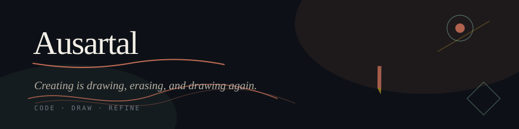
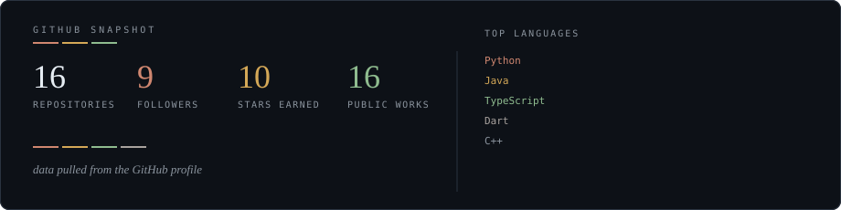

<div align="center">

<!-- hand-drawn-ish masthead -->


</div>

<br>

<table>
<td width="58%">

### Currently

Building **education-web-app** — a learning space where structure meets softness.  
Also elbow-deep in **computer vision** notebooks and data-mining labs.

I draw the same way I code: sketch first, refine later, erase without guilt.

</td>
<td width="42%" align="right">

```
      .  ˚
   .    ·
  ✎  creating
     is drawing
    erasing
   drawing again
      ·
```

</td>
</table>

---

<br>

<table>
<td width="38%" valign="top">

## Selected work

*Projects I keep coming back to.*

<br>

**Education Web App**  
TypeScript · ongoing  
A web space for teaching & learning — the one I'm refining the most right now.

**Surabaya Bus Tracking**  
TypeScript  
Real-time bus routes for the city. Wayfinding with a pulse.

**Computer Vision Course**  
Python  
Experiments, notebooks, and the occasional model that finally behaves.

**News App / Note App**  
Flutter  
Mobile pieces from when I lived in Dart full-time.

**Gastroentero Hepatology GUI** · **Infectious Diseases GUI** · **Platformer Game**  
Java  
Earlier work — medical tools and a game. Same hand, different ink.

<br>

*See the full shelf →* [github.com/ausartal](https://github.com/ausartal)

</td>
<td width="62%" valign="top">

## Materials I work with

<br>

| | |
|---|---|
| **Languages** | TypeScript · Python · Dart · Java · JavaScript |
| **Surface** | React · Flutter · Node · Express |
| **Under the hood** | Docker · Linux · Git · REST |
| **Currently studying** | Data mining · Computer vision · ML fundamentals |

<br>



<br>
<br>

> *"Creating is drawing, erasing, and drawing again."*

</td>
</table>

---

<br>

<div align="center">

*Find me*

&nbsp;&nbsp;&nbsp;[`github.com/ausartal`](https://github.com/ausartal)&nbsp;&nbsp;·&nbsp;&nbsp;[`Ausartal@users.noreply.github.com`](mailto:Ausartal@users.noreply.github.com)

<br>
<br>


</div>
